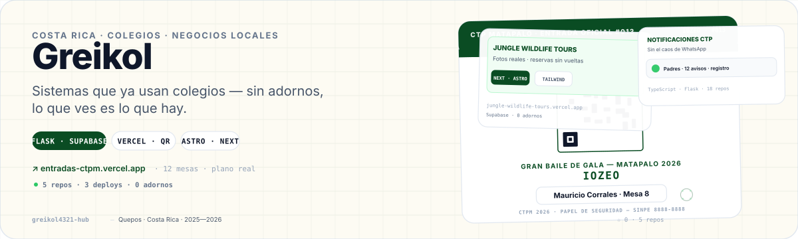

  

## Visión general

Soy Greikol, de Quepos. Hago sistemas pequeños que la gente usa de verdad. Me gustan las soluciones ágiles, sin enredos y con interfaces limpias que cualquiera entiende sin manual. Prefiero algo que funcione rápido y resuelva un problema concreto de la comunidad o un negocio local, antes que una idea grande que nunca sale.

Si ayuda en el día a día y no pide cosas raras para usarse, para mí ya vale.

## Proyectos

- **Entradas CTPM** — Venta para el Gran Baile del CTP Matapalo. Resuelve filas y pagos con SINPE, comprobante y QR de un solo uso con plano real de 12 mesas. · `Flask`, `Supabase`, `Vercel`, `Pillow`, `qrcode` · **[demo](https://entradas-ctpm.vercel.app)** · **[código](https://github.com/greikol4321-hub/entradas-ctpm)**

- **Jungle Wildlife Tours** — Web para guías de la selva. Cambia una plantilla genérica por fotos reales, reservas sin vueltas y panel para el equipo. · `Astro`, `Next.js`, `Tailwind`, `TypeScript`, `Supabase` · **[demo](https://jungle-wildlife-tours.vercel.app)** · **[código](https://github.com/greikol4321-hub/jungle-wildlife-tours)**

- **Taquilla** — Sistema de entradas QR por lugar. Vendedor genera, portero escanea y admin ve todo, cada uno en su lugar. · `Flask`, `Supabase`, `Vercel` · **[demo](https://taquilla-quepos.vercel.app)** · **[código](https://github.com/greikol4321-hub/taquilla)**

## Stack tecnológico

`Flask` · `Supabase (Postgres + Storage)` · `Vercel` · `Pillow` · `qrcode` · `Astro` · `Next.js` · `Tailwind` · `TypeScript` · `Python` · `psycopg` · `pydantic`

Lo uso porque ya lo probé en producción y no me ha dado problemas, no por moda.

---

  <a href="https://entradas-ctpm.vercel.app">entradas-ctpm</a> · <a href="https://jungle-wildlife-tours.vercel.app">jungle</a> · Quepos, Costa Rica

